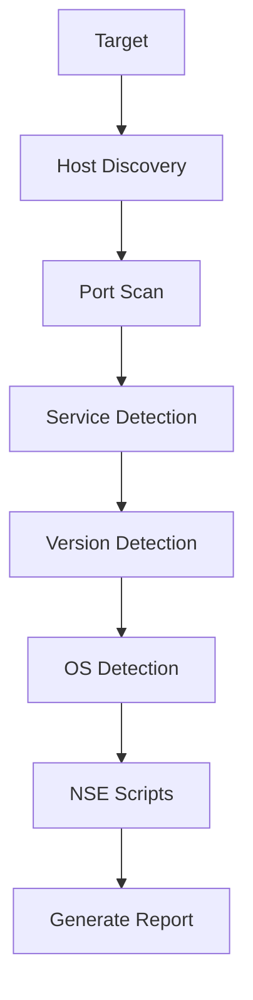

<div align="center">

# 🛰️ Nmap (Network Mapper)

### *The Industry Standard Tool for Network Discovery & Security Auditing*

<p align="center">


</p>

> 🚀 **Nmap (Network Mapper)** is a free and open-source tool used for **network discovery**, **host discovery**, **port scanning**, **service detection**, **OS detection**, and **security auditing**.

</div>

---

# 📑 Table of Contents

- Introduction
- Features
- How Nmap Works
- Scan Workflow
- Common Scan Types
- Important Options
- Port States
- Output Formats
- Real World Usage
- Best Practices
- Cheat Sheet

---

# 📖 What is Nmap?

**Nmap (Network Mapper)** is one of the most powerful tools used by:

- 🔴 Penetration Testers
- 🔵 SOC Analysts
- 🛡️ Security Engineers
- 🌐 Network Administrators
- ☁️ Cloud Engineers

It helps identify:

- Live Hosts
- Open Ports
- Running Services
- Service Versions
- Operating Systems
- Network Topology

---

# ✨ Features

- 🌐 Host Discovery
- 🚪 Port Scanning
- 🔍 Service Detection
- 💻 OS Detection
- 📍 Traceroute
- ⚡ NSE (Nmap Scripting Engine)
- 📄 Output Reporting

---

# ⚙️ How Nmap Works



---

# 🛰️ Nmap Scan Workflow

| Step | Description |
|-------|-------------|
| 1️⃣ | Enumerate Targets |
| 2️⃣ | Discover Live Hosts |
| 3️⃣ | Reverse DNS Lookup |
| 4️⃣ | Scan Open Ports |
| 5️⃣ | Detect Service Versions |
| 6️⃣ | Detect Operating System |
| 7️⃣ | Perform Traceroute |
| 8️⃣ | Execute NSE Scripts |
| 9️⃣ | Generate Scan Report |

---

# 🔍 Common Scan Types

## Host Discovery

```bash
nmap -sn 192.168.1.0/24
```

Finds all live hosts without scanning ports.

---

## Default Scan

```bash
nmap 192.168.1.10
```

Scans the 1000 most common TCP ports.

---

## Service Version Detection

```bash
nmap -sV 192.168.1.10
```

Identifies running services and their versions.

---

## Operating System Detection

```bash
sudo nmap -O 192.168.1.10
```

Attempts to identify the target operating system.

---

## Aggressive Scan

```bash
sudo nmap -A 192.168.1.10
```

Includes:

- OS Detection
- Version Detection
- NSE Scripts
- Traceroute

---

## Scan Specific Ports

```bash
nmap -p 22,80,443 192.168.1.10
```

Scans only selected ports.

---

## Scan All Ports

```bash
nmap -p- 192.168.1.10
```

Scans all **65535 TCP ports**.

---

# ⚡ Important Nmap Options

| Option | Purpose |
|---------|----------|
| `-sn` | Host Discovery |
| `-sS` | SYN Scan |
| `-sT` | TCP Connect Scan |
| `-sU` | UDP Scan |
| `-sV` | Version Detection |
| `-O` | OS Detection |
| `-A` | Aggressive Scan |
| `-Pn` | Skip Host Discovery |
| `-p` | Scan Specific Ports |
| `-p-` | Scan All Ports |
| `-T0` to `-T5` | Scan Speed |
| `--script` | Run NSE Scripts |
| `--traceroute` | Show Network Path |
| `-oN` | Normal Output |
| `-oX` | XML Output |
| `-oA` | Save All Formats |

---

# 🚪 Port States

| State | Meaning |
|--------|---------|
| Open | Port is accepting connections |
| Closed | No service is running |
| Filtered | Firewall is blocking access |
| Unfiltered | Accessible but state unknown |
| Open\|Filtered | Cannot determine |
| Closed\|Filtered | Cannot determine |

---

# 📄 Output Formats

Save Normal Output

```bash
nmap -oN scan.txt 192.168.1.10
```

Save XML

```bash
nmap -oX scan.xml 192.168.1.10
```

Save All Formats

```bash
nmap -oA report 192.168.1.10
```

---

# 🌍 Real World Uses

- Network Discovery
- Asset Identification
- Vulnerability Assessment
- Penetration Testing
- Firewall Testing
- Security Auditing
- Service Enumeration
- Network Inventory

---

# ⚠️ Best Practices

- Always obtain proper authorization before scanning.
- Avoid scanning public systems without permission.
- Use `-T4` for faster scans on trusted networks.
- Use `-A` only when detailed information is required.
- Save scan results for reporting.

---

# 📚 Nmap Cheat Sheet

| Task | Command |
|------|---------|
| Host Discovery | `nmap -sn <target>` |
| Default Scan | `nmap <target>` |
| Version Detection | `nmap -sV <target>` |
| OS Detection | `sudo nmap -O <target>` |
| Aggressive Scan | `sudo nmap -A <target>` |
| Scan Specific Ports | `nmap -p 22,80 <target>` |
| Scan All Ports | `nmap -p- <target>` |
| UDP Scan | `sudo nmap -sU <target>` |
| SYN Scan | `sudo nmap -sS <target>` |
| TCP Scan | `nmap -sT <target>` |
| Save Output | `nmap -oA report <target>` |

---

# 🧠 Key Points

- Nmap stands for **Network Mapper**.
- Developed by **Fyodor (Gordon Lyon)**.
- Open-source under the **GPL License**.
- Used for **Network Discovery** and **Security Auditing**.
- Supports **Host Discovery**, **Port Scanning**, **Service Detection**, **OS Detection**, and **NSE Scripts**.
- One of the most widely used tools in **Cybersecurity** and **Penetration Testing**.

---

<div align="center">

### ⭐ If you found these notes useful, don't forget to Star this repository!

Made with ❤️ by **Ujjwal Kumar**

</div>
